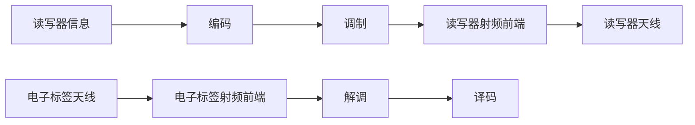
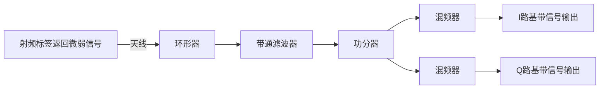

# 第一章 概述

## 1.1 自动识别技术

- 人类识别：视觉，听觉，味觉，触觉（成本比较高）
- 自动识别：利用被识别的物理对象的一些具有辨识度的特征进行区分和识别

### 1.1.1 指纹识别

利用指纹唯一性和稳定性进行区分

- 稳定，识别度高，错误率小
- 每个指纹具有多个特征点

技术原理与类型：

- 电容式，光学式，超声波式
- 电容式：移动设备
- 光学式：门禁，考勤系统（容易受到污染）
- 超声波式：水下通信（穿透力强，成本高）

发展趋势：

- 2D到3D
- 单点到全屏
- 接触式到非接触式

安全性：

- 在防伪攻击和隐私保护上存在挑战

### 1.1.2 人脸识别

基于面部特征，对人脸图像进行特征分析

- 传统方法：依赖特征工程
- 现代：深度学习算法

优势：

- 非接触式与便携性
- ...

劣势：

- 成本高
- ...

### 1.1.3 语音识别

利用发音和音色的不同辨别身份

### 1.1.4 一维码识别

容量小，辨识度低

### 1.1.5 二维码识别

定位点

容错机制

### 1.1.6 自动识别技术小结

- 视网膜识别技术（分析视网膜上的血管图案来区分）
- 心跳识别技术
- RFID

## 1.2 RFID的主要特点

- 非接触式的自动快速识别
- 永久存储一定量的数据
- 仅能进行简单的逻辑处理
- 反射信号强度受距离等因素影响明显（越高频受影响越大）
- 成本低廉，可大量部署

## 1.3 RFID的核心技术

制约因素：

- 标签资源及其受限（计算能力，存储空间，通信带宽）
- 真实环境下的性能受多种因素影响（阅读器发射功率，能量吸收，信号干扰，多径效应）

核心技术：

- 物理层：无线耦合与能量传输
- 硬件层：标签芯片与天线设计（低功耗，低成本；天线设计与匹配；存储与逻辑）
- 通信层：协议与防碰撞
- 数据与安全层：标准与加密
- 系统层：中间件与数据过滤

## 1.4 RFID的历史与现状

$敌我识别 \to 雷达技术 \to 应用 \to 标准化$

国际发展：

- 向“无芯”与“智能”两极探索

中国发展：

- 算法突破与性能优化
- 防碰撞算法，无源传感

## 1.5 RFID的发展趋势

## 1.6 第一周作业

实验项目规划

# 第二章 RFID系统组件原理

## 2.1 阅读器

### 2.1.1 阅读器功能

最重要的功能：供能，通信

- 供能：为射频标签提供能量

- 通信：类似射频标签和应用层的中间件
- 安全保证：使用加密，揭秘功能
- 自组网能力，接口等

### 2.1.2 阅读器分类

按工作频率：频率越高，能量越高，传输越远，信号衰减越厉害，对障碍物越敏感

- 低频和高频的阅读器，工作距离一般小于1m（常见13.56MHz）
- 超高频和特高频的阅读机，工作距离一般大于1m（一般几百MHz,或者GHz）

按照频率分类：

- 低频系统
- 高频系统
- 微波系统

通信方式：

- 长波和短波：电磁耦合
- 超短波和微波：电磁发射

按照结构外观分类：

- 固定式
- 便携式
- 工业读写器

### 2.1.3 阅读器操作规范

- 工作频率
- 防碰撞性能
- 射频识别协议灵活性
- 国家（地区）无线电管理规范
- 网络通信协议
- 多天线的支持能力
- 中间件接口

### 2.1.4 阅读器组成

编码作用：使用编码策略，将不变信号变为变化的信号传送

天线：将电磁波转换为电流信号，或者将电流信号转换成电磁波发射出去

### 2.1.5 信号处理与控制模块

- 与上位机进行通信，并执行从上位机发来的指令

- 控制与射频标签的通信过程

- 信号的编码和解码

- 防碰撞算法

- 数据进行加密和解密

- 进行身份验证

### 2.1.6 射频模块

**电感耦合型射频模块：**（近距离）

- 低频高频RFID系统通过阅读器和射频标签之间的电感耦合工作
- 一般是无源的，通过电感耦合给标签提供能量

低频读写器实例：基于U2270B芯片的读写器

振荡器：为系统提供稳定的心跳

天线驱动器：放大信号，让信号更好地从天线发送出去

**电磁反向散射耦合型射频模块：**（远距离）

- 远距离超高频RFID系统利用阅读器与射频标签之间的电磁反向散射耦合原理工作，类似于雷达
- 阅读器需要不断发送射频信号
- 阅读器发送信号和标签返回信号频率相同，强度不同

源模块：为发送和接收提供振荡

发送模块：

接收模块：

## 2.2 射频标签

### 2.2.1 标签作用

标签的作用中，最重要的是：存储数据，非接触式读写

- 存储数据：物品相关的信息，如标识符，生产日期，生产厂家等

- 能量获取：从阅读器的电磁场中吸收能量

### 2.2.2 标签的分类

按照封装形式

按照能量来源：

- 有源标签（主动标签，依靠自身电池）
- 无源标签（利用阅读器发射的载波信号获取能量）
- 半无源标签（电路板上即成电池，但作为辅助备用）

按照工作频率：

- 低频标签（距离近，存储容量小）
- 高频标签（传输快，存储大）
- 超高频标签（距离远，速率高，多标签读写性能好）

通信受到影响的地方：

- 电磁波
- 接收的灵敏度和解码能力
- 编码效率

按照读写能力：

- 只读标签
- 读写标签

### 2.2.3 标签操作规范

### 2.2.4 标签组成

- 天线：决定了标签的尺寸
- 芯片：对收到的信号进行解调，解码；对发送的信号进行编码，调制；执行防碰撞算法和存储数据

### 2.2.5 标签天线

用来耦合、辐射电磁能量的导体结构

- 线圈型天线
  - 工艺简单，成本低
  - 低频和高频近距离广泛使用
  - 利用电感耦合工作
- 微带贴片型
  - 贴有导体接地板的介质基础上贴加带有导体薄片而形成的天线
  - 质量轻，体积小，成本低，易于大量生产
  - 适用于通信方向不变的场景
- 偶极子天线
  - 由两端长度，粗细程度相同的直导线排成一条构成的天线
  - 适用于超高频标签
  - 全向天线（辐射是各个方向上的）

### 2.2.6 标签芯片

$模拟部件 \leftrightarrow 控制部件 \leftrightarrow 存储部件$

- 模拟前端：提供稳定的电压

- 控制部件：数据解码，数据校验，数据编码，加密解密，防碰撞，读写控制
- 存储部件：标签数据载体

### 2.2.7 电子标签芯片实例

H4006芯片

- 传输速率：26484bps（工作频率13.56MHz，分频512）

- 引脚：只读，C1和C2处接入电感线圈，另外4个用于测试

MIFARE技术(S50)

### 2.2.8 天线制造技术

- 线圈绕制法
- 蚀刻法

- 印制法（耐用年限短，电阻大，用于商品）

### 2.2.9 天线

能够有效地向空间某特定方向辐射电磁波或者能够有效地接收空间某特定方向来的电磁波的装置

用来发射和接收无线电波的装置和部件

功能：

- 辐射和接收电磁波
- 能量转换

电波是如何在天线形成并辐射出去的：

- 电场变化产生磁场
- 电压极性在正负之间变换
- 将电极两端拉成直线就成了半波偶极子天线

天线场：

- 感应场（近区场）
- 辐射场（远区场）

近区场：$r << \frac{\lambda}{2 \pi}$

- 电磁场强度远比远区场大

远区场：$r >> \frac{\lambda}{2 \pi}$

天线的电参数：

1. 天线的效率：辐射功率与输入功率的比值
2. 输入阻抗：天线输入端电压和电流的比值（输入端：天线与馈线的连接处）
3. 方向性函数：以天线为中心，天线辐射场与空间方向的关系
4. 方向图：天线辐射特性与空间坐标之间的函数图形

极化：在天线最大辐射方向上，电厂适量的方向随时间变化的规律

- 线极化（商品标签）
- 圆极化/椭圆极化（阅读器）

（天线不能接收正交方向的电磁波，阅读器和标签的极化方向必须匹配）

## 2.3 RFID射频前端

实现射频能量和信息传输的电路。

### 2.3.1 电感耦合方式的射频前端

对读写器天线电路的构造有以下要求：

- 读写器天线上的电流最大，使读写器线圈产生最大磁通
- 功率匹配，最大程度地输出读写器的能量
- 足够的带宽，使读写器信号无失真输出

谐振及其条件：

- 在特定条件下出现端口电压、电流同相位的现象
- 谐振的条件：$\omega_0 = \frac{1}{\sqrt{LC}}$（谐振角频率）

串联电路实现谐振：

- 调频，调容，调感

### 2.3.2 串联谐振电路的基本特征（读写器端）

- 谐振时阻抗为R
- 谐振时电流最大
- 电感电压与电容电压相等，大小相反，是U的Q倍（品质因素，$Q = \frac{\omega_0 L}{R}$）

- 能量关系：电感和电容上存储的能量为常数：$w = \frac{1}{2} L I_0^2$

  能量消耗在负载电阻上

- 带宽：$BW = \frac{\omega_0}{Q}$

  - 品质因数越高，相对带宽越小
  - 根据带宽要求调整谐振电路的品质因素，可以满足读写器信号无失真输出

### 2.3.3 并联谐振电路（标签端）

- 使标签天线上电压最大

谐振频率：$\omega_0 = \frac{1}{ \sqrt{LC} }$

- 谐振时电感的支路电流和电容的支路电流近似相等，是总电流的Q倍
- 输入导纳为$\frac{1}{R}$
- $Q = \frac{R}{\omega_0 L}$

电子标签的直流电压：

- 交变电压通过整流、滤波、稳压后给电子标签芯片提供所需的直流电压

## 2.4 软件系统

# 第三章 RFID通信

## 2.1 数字通信模型

数字通信的特点：

- 传输过程中可以实现无噪声积累
- 便于加密处理
- 便于设备集成和微型化
- 占用的信道频道宽

## 2.2 数字数据到数字信号

数字信号：

- 离散的不连续的电压脉冲
- 一个脉冲代表信号的元素（码元）
- 二进制数据可以直接编码成信号元素

信号的解读：

- 接收方需要知道：
  - 各个比特的定时方式：何时开始，何时结束
  - 每个比特信号的电平状态：高还是低
  - 两项任务是通过在每个比特间隔的中间位置采样来进行的

数字-数字编码类型：

- 单极性编码（单点平）
- 极性码（双电平）
- 双极性码（多电平）

单极性编码：

- 传输数字信号最简单的方法
- 只用一个电平表示两个二进制数字
- 接收方不好解读（不变的信号不具备同步机制）
- 存在问题：
  - 直流分量，平均振幅不是0,滤波器和变压器无法处理。主要用于光纤传输
  - 同步：接收方不能正确判断每一个比特何时开始，何时结束

编码方案的评价指标：

- 信号频谱（没有高频分量，没有直流分量）
- 时钟同步（提供基于所传送信号的同步机制）
- 差错检测
- 信号干扰和抗噪声度
- 费用和复杂性

## 2.3 RFID常用的编码方法

### 2.3.1 不归零编码（NRZ）

高电平表示二进制的1，低电平表示二进制的0

- 存在直流分量
- 没有同步机制
- 接收端判决门限与信号功率有关，不方便使用
- 比较简单，适合近距离传输

### 2.3.2 曼彻斯特编码

用电压的跳变来区分1和0,下降沿表示1,上升沿表示0

- 不存在直流分量
- 有同步机制
- 有利于判断读写器的碰撞发生
- 每个码元被调制成两个电平，数据传输速率只有调制速率的$\frac{1}{2}$
- ISO 144443 TYPE A 标签向读写器传输数据时采用

### 2.3.3 差动双向编码（DBP）

- 每个位开始时，电平反向
- 每个位中间出现电平跳变表示二进制0
- 每个位中间不跳变表示二进制1
- 位节拍容易重建

### 2.3.4 米勒编码

- 位中间跳变表示1,不跳变表示0
- 出现**连续的0**时，数据开始时增加一个跳变防止失步

## 2.4 RFID编码方式的选择因素

1. 电子标签能量的来源
   - 码型丰富的编码方式能量更高
2. 电子标签检错的能力
   - 曼彻斯特，差动双向，单极性归零具有较强的编码检错能力
3. 电子标签时钟的提取
   - 编码是否携带同步信息，曼彻斯特，差动双向，米勒编码提供同步信息

## 2.5 调制与解调

### 2.5.1 信号调制的原因

为了有效传输信息，天线通信系统需要采用较高频率的信号。

- 天线有效发射的需要（便于发射）
- 有效传输的需要（频率越高，带宽越高，抗衰弱能力更强）
- 可以实现信道的复用，提高信道利用率

### 2.5.2 信号调制的方法

载波调制：调幅，调频，调相

 调幅：振幅键控

- 载波信号与基带信号相乘

- 受噪声影响大，不适合远距离传输

调频：频移键控

- 使用不同频率区分1和0
- 抗噪声比较好
- 占用带宽较大

调相：相移键控

绝对相位键控：

- 使用**未调载波**的相位作为基准调制
- 接收方与发送方有一个相同的基准

相对相位键控：

- 利用前后**相邻码元**的相对载波相位差值去表示数字信息的一种方式
- 相邻码元（前一个码元）的相位不同表示0，相邻码元的相位相同表示1
- 需要使用码变换，将绝对吗变为相对码

标签向阅读器传输：

- 电感耦合（负载调制）
  电阻负载调制和电容负载调制
  电阻：引发电压变化
  电容：影响谐振状态（$\omega_0 = \frac{1}{\sqrt{L C}}$）
- 反向散射（反向散射调制）
  对天线阻抗进行控制，使用调制信号控制阻抗开关

举例：ISO/IEC 18000-6协议

阅读器向标签：

- 数据编码：脉冲间隔编码（PIE）
  - 1到0的时间不同（0半个周期，1 3/2个周期）
  - 保证较长时间有能量传输
- 调制方式：
  - ASK调制
- 帧格式

电子标签向阅读器的数据传输：（反向散射）

- 数据编码：FM0（差动双向）
- 调制：天线阻抗变化

# 第三章 无线通信

## 3.5 链路预算

- 前向链路（阅读器调制，标签解调）
- 反向链路（阅读器解调，标签调制）

标签需要多少能量？最多能在多远的距离进行识别？

- 链路预算：将数据成功从发送端传输到接收端所需要的能量

### 3.5.1 阅读器传输能量

- 阅读器的功率被限定在某个安全范围
- 多数RFID设备工作在ISM频段
- 最大传输能量一般不超过1W

### 3.5.2 路径损耗

传输过程中，传输器发送的能量和接收器接收到的能量之间的差异。

有效孔径：标签实际接收到的能量，和区域内穿过标签的天线能量密度成正比。这个区域称为有效孔径

接收到的能量密度为$P_t=A_e $，A_e为有效孔径

$P_{RX}=P_{TX}\frac{A_e}{4 \pi r^2}$

$A_e=\lambda^2/4 \pi$，$\lambda$为915MHz信号对应的波长

发送能量为1W，据此可以计算出不同距离天线接收到能量

### 3.5.3 标签激活能量

- 标签需要10~30 uW的能量来激活电路
- 能量利用率只有30%，所以标签要获取30～100uW
- 阅读器提供的最大能量是1W（30dBm）,芯片设置阈值为100uW(-10dBm)，路径损耗最大值为40dBm。

限制传输距离：前线链路。

- 标签接收能量的性能比较弱
- 阅读器可以接收更低能量的信号

### 3.5.4 天线增益对传输范围的影响

天线增益：在输入功率相等的条件下，实际天线与理想的辐射的能源在空间同一点处产生的信号的功率密度之比

天线极化：天线最大辐射方向上，电场矢量方向随时间变化的规律

### 3.6.1 天线增益的影响

- 定向天线：将能量集中于一处进行辐射的天线

不是所有天线都有很好的方向性：偶极子天线

## 3.7 真实环境下的信号传输

## 3.8 总结

- 载波频率
  低频高频短距离，超高频长距离
- 调制编码
- 链路预算
