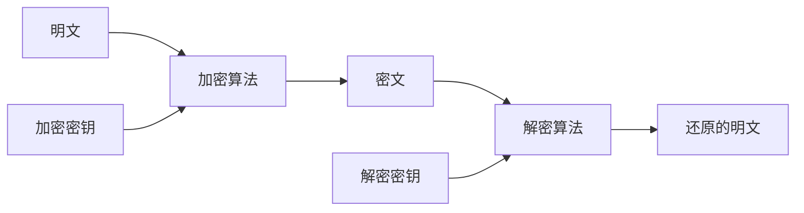

## 1 简介

### 1.1 简介

考核方式：

- 出勤40+课堂成绩20（课堂测验）+报告成绩40（文献阅读）

#### 1.1.1 物联网概念与特征

- 按照某种约定，将任何物品与互联网连接起来，进行信息交换与通信

#### 1.1.2 物联网的发展

- RFID

#### 1.1.3 物联网分层

- 感知，传输，（数据处理），应用

#### 1.1.4 物联网特征

- 全面感知，可靠传输，智能处理

#### 1.1.5 物联网安全事件

- 智能玩具泄漏父母与儿童语音信息
- 基带漏洞可攻击数百万部华为手机
- 机器人吸尘器漏洞，远程控制数千台设备（数据存储明文，认证机制设计不安全）
- Eleven11 Botnet；8.6万IoT设备被攻陷
- 自动售货机泄漏用户数据
- 安防摄像头漏洞
- 蓝牙协议8个零日漏洞
- 美国交通指示牌被攻击，播放反trump语言

### 1.2 物联网安全问题分析

网络安全引入：

- 信息安全
  - 计算机安全（信息存储和处理过程）
  - 网络安全（信息传输过程，正常和非法访问）

网络安全目标：

- 保密性
  - 机密性
  - 隐私性
- 完整性（不可被篡改）
- 不可抵赖性（通信参与者不能否认自己进行的操作）

- 可用性
- 可控性

### 1.3 安全威胁

- 恶意代码
- 远程入侵
- 拒绝服务
- 信息窃取和篡改
- 身份假冒

#### 1.3.1 恶意代码

- 计算机病毒（自我复制能力，会对系统造成巨大破坏的恶意代码）
- 蠕虫
- 特洛伊木马
- 逻辑炸弹

#### 1.3.2 远程入侵

#### 1.3.3 拒绝服务攻击

- 让目标主机停止提供服务或者资源访问
- 对网络带宽进行消耗性攻击

- 利用系统漏洞使系统崩溃

#### 1.3.4 身份假冒

- IP地址假冒

#### 1.3.5 信息窃取和篡改

- 主动攻击
  - 重放（窃取信息后按照之前的顺序重新传输）
  - 篡改（窃取到信息进行修改，延迟或重排，再发给接收方）
  - 冒充（重放的一种）
  - 伪造（冒充合法身份插入虚假信息）
  - 阻断（中断通信双方的网络传输过程，如屏蔽信号）

- 被动攻击
  - 窃听

### 1.4 物理层安全

- 防盗，防火，防电磁泄漏

### 1.5 系统层安全

- 及时修复系统漏洞
- 防止系统的安全配置错误

### 1.6 网络层安全

- 路由器安全

### 1.7 应用层安全

- web安全（钓鱼网站）

### 1.8 网络攻击技术

- 对网络安全产生危害的行为
- 读取攻击
- 操作攻击
- 欺骗攻击
- 泛洪攻击
- 重定向攻击

### 1.9 网络防御技术

### 1.10 访问控制

### 1.11 入侵防御

## 2 DES加密

### 2.1 对称密钥密码结构

现代分组密码设计的出发点：

- 为统计分析制造障碍，只能暴力分析

分组密码的设计要求：

- Diffusion（弥散）
  密文没有统计特征，明文一位影响密文多位，密钥的一位也影响密文的多位
- Confusion（混淆）
  明文与密文，密钥与密文的依赖关系充分复杂

Feistel结构：

- 基于循环迭代
- 采用替代与换位
- 实现混淆与弥散
- 结构：
  - 明文经过n轮循环得到密文
  - 每一轮循环的结构都一样
  - 替代+置换

## 3 公钥密码体制

- 公钥密码的体制原理
- RSA加密算法
- DH加密算法
- 中间人攻击

公钥密码体制的特点：

- 根据密码算法无法推出加密密钥和解密密钥
- 两个密钥中的任何一个可以用来加密，另一个用来解密

使用公钥传递对称密钥

- 直接使用公钥：太慢
- 只用来传递会话密钥

# 4 数字签名

特征：

- 验证签名者，日期和时间
- 能够认证被签信息
- 能够被第三方仲裁

数字签名由以下组成：

- 明文M
- 签名空间S
- 密钥空间K
- 认证密钥空间K'
- 密钥生成算法
- 签名算法s
- 验证算法verify

分类：

- 直接数字签名
- 基于仲裁的签名

直接数字签名：

- 公开密钥
- 使用消息的散列码进行加密形成数字签名

基于仲裁的签名：

- 对称密钥加密的方式
  - 发送方X与仲裁A共享一个密钥，A和Y共享密钥
- 